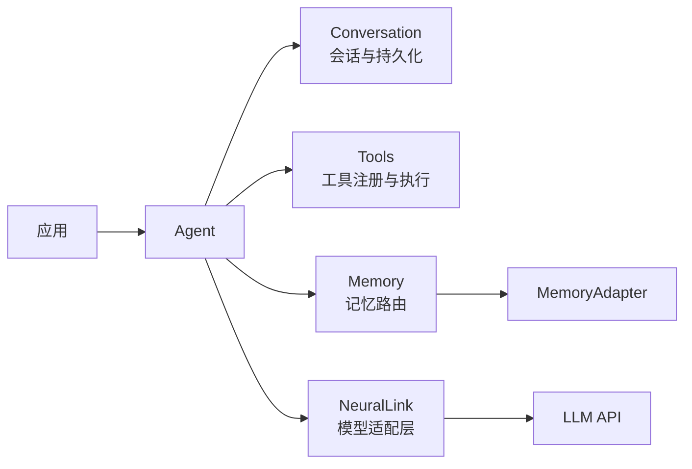

# WallE

WallE 是一个基于 TypeScript 的 Agent 运行时框架。它通过 NPM 预编译包
[`@maozy13/neuralink`](https://www.npmjs.com/package/@maozy13/neuralink) 连接兼容 SSE 的大模型接口，负责维护多轮会话、执行函数工具，并按需召回和更新长期记忆。

> 当前版本为 `0.1.0`，依赖 `@maozy13/neuralink@^0.1.0`。运行 `pnpm install` 时会直接安装 NeuralLink 的预编译产物，无需克隆或单独构建 NeuralLink 源码。

## 能力概览

- 使用统一的 `Agent` 接口运行多轮 Agentic Loop。
- 自动识别并并行执行模型返回的函数调用。
- 使用 Zod 定义工具参数，并在工具执行前完成运行时校验。
- 将会话持久化到本地，支持按 session ID 恢复。
- 通过可插拔的 `MemoryAdapter` 召回和更新长期记忆。
- 内置受限命令工具和交互式 CLI。
- 复用 NeuralLink 的规范化输入、响应和事件类型。



## 环境要求

- Node.js 18 或更高版本
- pnpm
- 支持 SSE 流式响应的模型接口

项目使用 ESM，集成方应使用 ESM，或通过支持 ESM 的构建工具加载。

## 安装

### 从源码构建

```bash
git clone https://github.com/maozy13/walle.git
cd walle
pnpm install
pnpm build
```

`pnpm install` 会从 NPM 安装预编译的 `@maozy13/neuralink`；`pnpm build` 仅构建 WallE 自身。

构建完成后，可以将仓库作为本地依赖加入应用：

```bash
cd /path/to/your-app
pnpm add /path/to/walle
```

在 pnpm workspace 中，也可以将 WallE 放入 workspace，并在应用的
`package.json` 中声明：

```json
{
  "dependencies": {
    "walle": "workspace:*"
  }
}
```

使用 workspace 方式时，请确保在运行应用前已经构建 WallE。

## SDK 集成

WallE 的包入口即 TypeScript SDK。通常只需要创建一个 NeuralLink 连接器，再用它初始化 `Agent`；工具、会话和记忆均为可选能力。

### 初始化与流式输出

以下示例连接一个兼容 Responses API 的接口，并实时输出模型回复：

```ts
import {
  Agent,
  Connector,
  ResponsesAPIConverter,
  type Response,
} from "walle";

const apiKey = process.env.LLM_API_KEY;
if (apiKey === undefined) {
  throw new Error("LLM_API_KEY is required");
}

const llm = new Connector(
  "https://example.com/v1/responses",
  apiKey,
  new ResponsesAPIConverter(),
);

const agent = new Agent({
  llm,
  instructions: "你是一个简洁、可靠的开发助手。",
  cwd: process.cwd(),
});

/** 提取规范化响应中的可见文本。 */
function responseText(response: Response): string {
  return response.output
    .filter((item) => item.type === "message")
    .map((item) => item.content.type === "output_text"
      ? item.content.text
      : item.content.refusal)
    .join("\n");
}

let rendered = "";
for await (const event of agent.query("your-model", "用一句话介绍 WallE。")) {
  const next = responseText(event.response);
  if (next.startsWith(rendered)) {
    process.stdout.write(next.slice(rendered.length));
  }
  rendered = next;

  if (event.type === "agent.response.failed") {
    throw new Error("Model response failed");
  }
}
```

`Agent.query()` 返回 `AsyncGenerator<AgentEvent, Response>`。每个事件中的
`response` 都是当前时刻的完整快照，而不是单独的文本增量；流结束时生成器的返回值是最终 `Response`。如果需要读取这个返回值，请直接循环调用 `query.next()`，而不是使用 `for await...of`。

### Agent 配置

```ts
new Agent(options: AgentOptions)
```

| 参数 | 类型 | 必填 | 说明 |
| --- | --- | --- | --- |
| `llm` | `Pick<Connector, "call">` | 是 | NeuralLink 连接器或实现相同 `call()` 接口的对象 |
| `instructions` | `string` | 否 | 每轮模型调用都会注入的系统指令 |
| `conversation` | `Conversation` | 否 | 自定义会话容器；默认创建空会话 |
| `tools` | `Tools` | 否 | 自定义工具集；省略时使用包含受限 `bash` 工具的默认工具集 |
| `memory` | `Memory` | 否 | 需要注册到 Agent 的记忆系统 |
| `cwd` | `string` | 否 | 会话、记忆和默认工具的工作目录；默认为 `process.cwd()` |
| `sessionId` | `string` | 否 | 启动时需要从 `cwd/sessions` 恢复的会话 ID |

`conversation` 与 `sessionId` 通常二选一。若同时传入，Agent 会在提供的 Conversation 对象上加载 `sessionId` 对应的持久化内容。

### 发起查询

```ts
agent.query(
  model: string,
  input: string | InputItem[],
  optional?: AgentQueryOptions,
): AsyncGenerator<AgentEvent, Response>
```

| 参数 | 说明 |
| --- | --- |
| `model` | 模型服务使用的模型 ID |
| `input` | 文本或 NeuralLink 规范化结构化输入 |
| `optional.instructions` | 仅作用于本次任务的附加系统指令 |

SDK 会自动把当前会话和工具 Schema 发送给模型、执行函数调用、追加工具结果，并继续请求模型，直到当前任务不再产生工具调用或模型返回失败/未完成状态。

### 响应事件

| 事件 | 含义 |
| --- | --- |
| `agent.response.created` | 一轮底层模型响应已创建 |
| `agent.response.changed` | 当前响应的文本、推理或函数调用发生变化 |
| `agent.response.completed` | 一轮底层模型响应完成 |
| `agent.response.failed` | 一轮底层模型响应失败 |
| `agent.response.incomplete` | 一轮底层模型响应提前结束 |

一次 Agent 任务可能包含多轮模型调用，因此可能产生多组 `created`、`changed` 和 `completed` 事件。应以异步生成器结束及其返回的 `Response` 作为整个任务结束的标志。

如果业务既需要处理事件，又需要最终响应，可以使用以下消费方式：

```ts
import type { AgentEvent, AgentQuery, Response } from "walle";

/** 消费完整 Agent 任务，并返回最后一轮规范化响应。 */
async function consumeAgent(
  query: AgentQuery,
  onEvent: (event: AgentEvent) => void,
): Promise<Response> {
  while (true) {
    const next = await query.next();
    if (next.done) return next.value;
    onEvent(next.value);
  }
}

const response = await consumeAgent(
  agent.query("your-model", "分析当前项目"),
  (event) => console.log(event.type),
);

console.log("最终状态：", response.status);
```

### 单次查询指令

Agent 会把构造时的 `instructions` 与单次查询的 `instructions` 合并：

```ts
agent.query("your-model", "审查这段代码", {
  instructions: "只报告会造成运行错误的问题。",
});
```

## 注册自定义工具

工具是带有名称、描述和 Zod 参数 Schema 的函数。函数名就是暴露给模型的工具名：

如果集成方尚未直接依赖 Zod，请先运行 `pnpm add zod`。不要依赖 WallE 的传递依赖来解析应用自己的 import。

```ts
import { Agent, Tools, type FuncTool } from "walle";
import { z } from "zod";

const weatherParameters = z.object({
  city: z.string().min(1).describe("城市名称"),
}).strict();

interface WeatherResult {
  city: string;
  condition: string;
  temperature: number;
}

/** 查询指定城市的天气。 */
async function get_weather(
  parameters: z.output<typeof weatherParameters>,
): Promise<WeatherResult> {
  // 在这里调用真实的天气服务。
  return {
    city: parameters.city,
    condition: "sunny",
    temperature: 25,
  };
}

const weatherTool: FuncTool<typeof weatherParameters, WeatherResult> = Object.assign(
  get_weather,
  {
    description: "查询指定城市的实时天气",
    parameters: weatherParameters,
  },
);

const tools = new Tools([weatherTool]);
const agent = new Agent({ llm, tools });
```

也可以稍后注册：

```ts
tools.register(weatherTool);
```

工具参数由 Zod 校验。未知工具、重复名称、非法 JSON 或不符合 Schema 的参数都会作为工具错误返回给模型，由模型决定如何继续。

> 不传 `tools` 时，Agent 默认注册内置 `bash` 工具；显式传入 `new Tools(...)` 会替换默认工具集。内置工具使用命令白名单且不启动 shell，但仍应为 Agent 配置权限受限的工作目录和运行账号。

## 会话与持久化

每次查询都会将用户输入、模型输出、函数调用和工具结果写入：

```text
<cwd>/sessions/<session-id>/CONVERSATION.md
<cwd>/sessions/<session-id>/ARCHIVES/
```

新 Agent 会自动生成 session ID，可以通过 `agent.conversation.id` 获取。恢复已有会话时传入同一个工作目录和 session ID：

```ts
const agent = new Agent({
  llm,
  cwd: "/srv/my-agent",
  sessionId: "existing-session-id",
});
```

如果对应会话不存在或内容无效，构造函数会抛出异常。并发进程不应同时写入同一个 session。

如需自行管理上下文，可以显式创建 `Conversation`：

```ts
import { Agent, Conversation } from "walle";

const conversation = new Conversation([], "customer-support-42", process.cwd());
const agent = new Agent({ llm, conversation });
```

## 记忆

`Memory` 负责把模型的召回和更新请求路由到不同的 `MemoryAdapter`。内置
`TermsMemoryAdapter` 将术语表保存在 `<cwd>/memories/TERMS.md`：

```ts
import { Agent, Memory, TermsMemoryAdapter } from "walle";

const cwd = process.cwd();
const memory = new Memory([
  new TermsMemoryAdapter(cwd),
]);

const agent = new Agent({
  llm,
  cwd,
  memory,
});
```

配置记忆后，主 Agent 会获得 `memory.retrieve` 工具。每次任务结束时，WallE 还会启动一次独立的模型循环来判断是否调用 `memory.update`，因此一次 `query()` 可能产生额外的模型请求，并会在记忆更新完成后才彻底结束。

自定义适配器需要实现同名的 `retrieve` 和 `update` 操作：

```ts
import type { MemoryAdapter, MemoryOperation } from "walle";

/** 为记忆操作附加模型可读的名称和说明。 */
function memoryOperation(
  name: string,
  description: string,
  callback: (input: string) => unknown | Promise<unknown>,
): MemoryOperation<string> {
  Object.defineProperty(callback, "name", { value: name });
  return Object.assign(callback, { description });
}

const profileMemory: MemoryAdapter = {
  retrieve: memoryOperation(
    "profile",
    "当任务依赖用户偏好时召回用户画像。",
    async (query) => loadProfile(query),
  ),
  update: memoryOperation(
    "profile",
    "当用户明确表达稳定偏好时更新；content 是 JSON 字符串。",
    async (content) => saveProfile(JSON.parse(content)),
  ),
};
```

`loadProfile` 和 `saveProfile` 由集成方实现。适配器名称必须非空，且两个操作的名称必须一致。

## 结构化输入

除字符串外，`Agent.query()` 还接受 NeuralLink 的 `InputItem[]`：

```ts
for await (const event of agent.query("your-model", [{
  type: "message",
  role: "user",
  content: [
    { type: "input_text", text: "描述这张图片" },
    { type: "input_image", image_url: "https://example.com/image.png" },
  ],
}])) {
  if (event.type === "agent.response.completed") {
    console.log(responseText(event.response));
  }
}
```

Responses API 转换器支持规范化的文本、图片和文件输入。NeuralLink 的 Chat Completions 和 Anthropic 转换器当前只支持文本输入；如需在应用中直接导入这些转换器，请将 `@maozy13/neuralink` 声明为应用的直接依赖，再从该包导入转换器并传给 WallE 的 `Agent`。

## CLI

源码构建完成后可以启动交互式 CLI：

```bash
node bin/walle.js \
  --base-url https://example.com/v1/responses \
  --model your-model \
  --api-key "$LLM_API_KEY"
```

CLI 当前使用 Responses API 转换器。输入 `/exit` 或 `/quit` 退出。

也可以在运行目录创建 `.walle`：

```json
{
  "baseUrl": "https://example.com/v1/responses",
  "model": "your-model",
  "apiKey": "replace-with-your-api-key",
  "session": "optional-session-id",
  "log": false
}
```

运行目录中的 `WALLE.md` 会作为默认系统指令；`.walle` 中的 `instruction` 会覆盖它，命令行参数的优先级最高。启用日志后，记录写入 `logs/<session-id>.log`。

不要提交包含真实 API Key 的 `.walle`，也应避免通过会被 shell 历史记录的命令行参数传入密钥。

查看全部参数：

```bash
node bin/walle.js --help
```

## 核心 API

| 导出 | 用途 |
| --- | --- |
| `Agent` | 组织模型调用、工具执行、会话和记忆生命周期 |
| `Tools` | 注册、列举和执行 Zod 工具 |
| `Conversation` | 管理上下文并持久化 session |
| `Memory` | 注册和路由记忆适配器 |
| `TermsMemoryAdapter` | 基于 Markdown 文件的术语记忆 |
| `Connector` | NeuralLink 模型连接器 |
| `ResponsesAPIConverter` | Responses API 请求与事件转换器 |
| `resolveCliConfig` / `runCli` | 以代码方式集成 CLI 配置和运行时 |

WallE 同时从包入口重新导出自身及 NeuralLink 的公共类型，包括
`AgentOptions`、`AgentEvent`、`FuncTool`、`MemoryAdapter`、`InputItem` 和 `Response`。

## 数据与安全边界

- 会话、记忆和可选日志默认以明文写入 `cwd`，生产环境应自行配置目录权限、备份与清理策略。
- `Connector` 当前使用 `Authorization: Bearer <apiKey>`，其他认证方式需要通过兼容网关适配。
- 模型接口必须提供 SSE 流；非流式接口不能直接使用。
- `Agent` 会用注册工具覆盖单次查询参数中的 `tools`。动态工具应通过 `Tools.register()` 管理。
- 工具结果会被序列化并发送回模型，不要返回不应离开本机的敏感信息。

## 本地开发

```bash
pnpm install
pnpm typecheck
pnpm test
pnpm build
```

首次执行 `pnpm install` 时会同时安装可直接使用的 NeuralLink 预编译包，以上开发命令均不再单独编译 NeuralLink。

项目要求单元测试行覆盖率达到 100%，条件覆盖率达到 95% 以上。架构设计以
[`design/`](design/) 目录为唯一来源；实现变更应先核对相应设计文档。

## License

当前仓库尚未声明开源许可证。用于分发或商业项目之前，请先与项目维护者确认授权范围。
