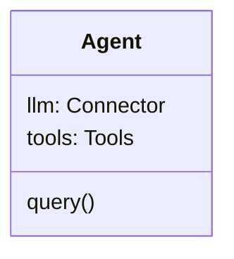
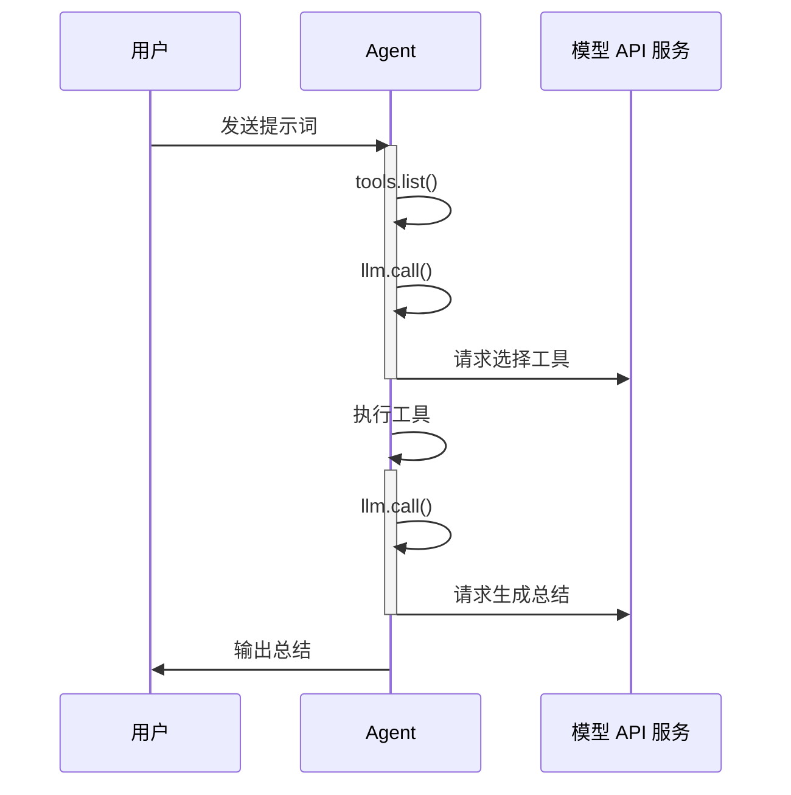

# WallE

WallE 是一个 Agent 运行时框架。

## 架构

WallE 深度依赖 [neuralink](https://github.com/maozy13/neuralink.git) 用于连接各种 LLM API 服务的模型适配层。



WallE 内部包含以下组件：

- Tools：用于管理工具，仅 Agent 内部使用。提供列举工具和注册工具接口。

**属性：**

| 属性 | 类型 | 说明 |
| -- | -- | -- |
| llm | Connector | neuralink 模型适配器 |
| tools | Tools | 工具集 |


## 方法

`query(model: string, input: string | Array<InputItem>, optional?: Optional): AsyncIterator<ResponseEvent, Response>` 

封装 neuralink Connector 的 call 方法。直接使用 neuralink 定义的类型。


## 工具使用

### 流程

Agent 使用工具按照以下流程执行：



## Tools

Tools 是 WallE 内部的工具管理模块，提供列举工具集及注册工具的接口。

WallE 内置 `bash` 工具，用于执行 CLI 命令。 `bash` 工具的设计参考 [bash](#bash)

## 使用示例
```typescript
import { Agent, Connector as LLM, ResponsesAPIConverter } from "walle";

const agent = new Agent({
    llm: new LLM({
        baseUrl: 'https://example.com/v1/responses',
        apiKey: process.env.LLM_API_KEY!,
        converter: new ResponsesAPIConverter(),
    })
})

for await event of agent.query('deepseek-v4-flash', '明天上海的天气怎么样？') {
    console.log(event.delta)
}

```

## 工具集

WallE 内置以下工具：

### **bash**<a id="bash"></a>
 
 用于执行 Bash 命令，接收 `command` 作为参数，返回 stdout 和 stderr。 Schema 定义如下：

 ```yaml
 name: bash
 description: |
    在当前工作目录执行一条 bash 命令，返回 stdout 和 stderr。
    出于安全考虑，只支持：ls、find、grep 等文件 read-only 命令，但禁止使用 edit、delete 类参数
    严禁执行任何权限命令：su、sudo、chmod、chown 等
    严禁执行任何删除命令：rm、rmdir 等
    严禁执行任何磁盘操作命令：mount、unmount、fdisk 等，但可以执行 du、df 等查看操作。
 parameters:
    - type: object
    - properties:
        - command:
            - type: string
            - description: 一条 bash 命令
 ```

