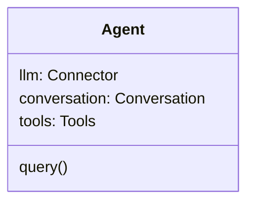

# WallE

WallE 是一个 Agent 运行时框架。

## 架构

WallE 深度依赖 [neuralink](https://github.com/maozy13/neuralink.git) 用于连接各种 LLM API 服务的模型适配层。

WallE 内部包含以下组件：

- Tools：用于管理工具，仅 Agent 内部使用。提供列举工具和注册工具接口。参考 [tools.md](tools.md)
- Conversation: 用于管理 Agent 会话。参考 [conversation.md](conversation.md)

### Agent

Agent Runtime 主程序。

**属性**

| 属性 | 类型 | 说明 |
| -- | -- | -- |
| llm | Connector | neuralink 模型适配器 |
| conversation | Conversation | 会话 |
| tools | Tools | 工具集 |

**方法**

`query(model: string, input: string | Array<InputItem>, optional?: Optional): AsyncIterator<AgentEvent>` 

接收用户请求，通过 Agentic Loop 多轮调用 `neuralink` 完成用户请求。

Agent 支持的 Agentic Loop 类型：

- [ReAct](react.md)

### 类型

#### AgentEvent

AgentEvent 可能是下列事件中的一种：

- AgentResponseCreated
- AgentResponseChanged
- AgentResponseCompleted
- AgentResponseFailed
- AgentResponseIncomplete

#### AgentResponseCreated

初始化一个新的响应对象。neuralink 输出 `response.created` 事件时映射到此事件。

**属性**

| 属性 | 类型 | 说明 |
| -- | -- | -- |
| type | "agent.response.created" | 事件类型，固定为 "agent.response.created" |
| id | string | 响应对象的 ID |
| response | object | 响应对象 |

#### AgentResponseChanged

单个响应对象发生更新。neuralink 输出 `response.*.added` 或 `response.*.delta` 事件时映射到此事件。

**属性**

| 属性 | 类型 | 说明 |
| -- | -- | -- |
| type | "agent.response.changed" | 事件类型，固定为 "agent.response.changed" |
| id | string | 响应对象的 ID |
| response | object | 响应对象 |

#### AgentResponseCompleted

单个响应对象生成完成。neuralink 输出 `response.completed` 事件时映射到此事件。

**属性**

| 属性 | 类型 | 说明 |
| -- | -- | -- |
| type | "agent.response.completed" | 事件类型，固定为 "agent.response.completed" |
| id | string | 响应对象的 ID |
| response | object | 响应对象 |

#### AgentResponseFailed

单个响应对象生成失败。neuralink 输出 `response.failed` 事件时映射到此事件。

**属性**

| 属性 | 类型 | 说明 |
| -- | -- | -- |
| type | "agent.response.failed" | 事件类型，固定为 "agent.response.failed" |
| id | string | 响应对象的 ID |
| response | object | 响应对象 |

#### AgentResponseIncomplete

单个响应对象中断生成。neuralink 输出 `response.incomplete` 事件时映射到此事件。

**属性**

| 属性 | 类型 | 说明 |
| -- | -- | -- |
| type | "agent.response.incomplete" | 事件类型，固定为 "agent.response.incomplete" |
| id | string | 响应对象的 ID |
| response | object | 响应对象 |