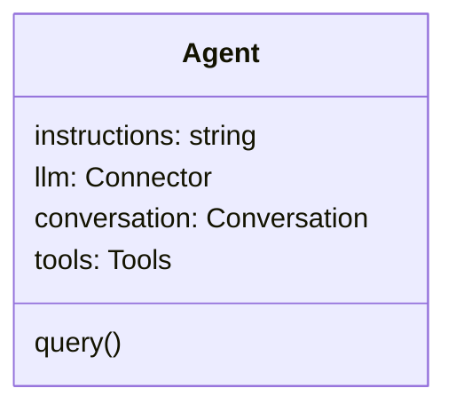

# WallE

WallE 是一个 Agent 运行时框架。

## 架构

WallE 深度依赖 [neuralink](@maozy13/neuralink) 模型适配层来连接各种 LLM API 服务。

WallE 内部包含以下组件：

- Tools：用于管理工具，仅 Agent 内部使用。提供列举工具和注册工具接口。参考 [tools.md](tools.md)。
- Conversation: 用于管理 Agent 会话。参考 [conversation.md](conversation.md)。
- Memory: 记忆组件，提供记忆的更新和召回。

### Agent

Agent 运行时主程序。

**属性**

| 属性 | 类型 | 说明 |
| -- | -- | -- |
| instructions | string | 系统提示词 |
| llm | Connector | neuralink 模型适配器 |
| conversation | Conversation | 会话对象 |
| tools | Tools | 工具集 |

**方法**

`query(model: string, input: string | Array<InputItem>, optional?: Optional): AsyncIterator<AgentEvent>` 

接收用户请求，通过 Agentic Loop 多轮调用 `neuralink` 完成用户请求。

### 构造函数

1、初始化 Agent 对象时，如果用户在构造函数中传递了 `sessionId` 属性，则从 `{cwd}/sessions/{sessionId}/CONVERSATION.md` 读取会话项列表并转换为 Conversaion 对象。
2、初始化 Agent 时，可以传入系统提示词 `instructions`，在每次和模型对话时都会注入到 neruallink 的系统提示词参数中。

### 类型

#### AgentEvent

AgentEvent 可能是下列事件中的一种：

- AgentRunCreated
- AgentResponseCreated
- AgentReasoningChanged
- AgentMessageChanged
- AgentFunctionCallCompleted
- AgentCustomToolCallCompleted
- AgentRunCompleted
- AgentRunFailed
- AgentRunIncomplete

#### AgentRunCreated

Agent 开始执行任务。当 neuralink **首次**输出 `ResponseCreated` 事件时触发一次此事件。注意：该事件与 AgentResponseCreated 不互斥且先于 AgentResponseCreated 事件。

**属性**

| 属性 | 类型 | 说明 |
| -- | -- | -- |
| type | "agent.run.created" | 事件类型，固定为 "agent.run.created" |
| id | string | 响应对象的 ID |

#### AgentResponseCreated

Agent 开始新一轮的响应输出。当 neuralink 输出 `ResponseCreated` 事件时映射到此事件。

**属性**

| 属性 | 类型 | 说明 |
| -- | -- | -- |
| type | "agent.response.created" | 事件类型，固定为 "agent.response.created" |
| id | string | 响应对象的 ID |
| response | object | 响应对象 |

#### AgentMessageChanged

单个响应对象发生更新。当 neuralink 输出 `ResponseMessageTextDelta` 事件时映射到此事件。

**属性**

| 属性 | 类型 | 说明 |
| -- | -- | -- |
| type | "agent.message.changed" | 事件类型，固定为 "agent.message.changed" |
| id | string | 响应对象的 ID |
| response | object | 响应对象 |

#### AgentReasoningChanged

单个响应对象发生更新。当 neuralink 输出 `ResponseReasoningTextDelta` 事件或 `ResponseReasoningSummaryTextDelta` 事件时映射到此事件。

**属性**

| 属性 | 类型 | 说明 |
| -- | -- | -- |
| type | "agent.reasoning.changed" | 事件类型，固定为 "agent.reasoning.changed" |
| id | string | 响应对象的 ID |
| response | object | 响应对象 |

#### AgentFunctionCallCompleted

单个响应对象生成完成。当 neuralink 输出 `ResponseCompleted` 事件且事件对象的 `output[].type` 包含 `function_call` 时映射到此事件。

**属性**

| 属性 | 类型 | 说明 |
| -- | -- | -- |
| type | "agent.function_call.completed" | 事件类型，固定为 "agent.function_call.completed" |
| id | string | 响应对象的 ID |
| response | object | 响应对象 |

#### AgentCustomToolCallCompleted

单个响应对象生成完成。当 neuralink 输出 `ResponseCompleted` 事件且事件对象的 `output[].type` 包含 `custom_tool_call` 时映射到此事件。

**属性**

| 属性 | 类型 | 说明 |
| -- | -- | -- |
| type | "agent.custom_tool_call.completed" | 事件类型，固定为 "agent.custom_tool_call.completed" |
| id | string | 响应对象的 ID |
| response | object | 响应对象 |

#### AgentRunCompleted

Agent 完成任务并不再输出。当 neuralink 输出 `ResponseCompleted` 事件且事件对象的 `output[].type` 只包含 `message` 或 `reasoning` + `message` 时映射到此事件。

**属性**

| 属性 | 类型 | 说明 |
| -- | -- | -- |
| type | "agent.run.completed" | 事件类型，固定为 "agent.run.completed" |
| id | string | 响应对象的 ID |
| response | object | 响应对象 |

#### AgentRunFailed

单个响应对象生成失败。当 neuralink 输出 `ResponseFailed` 事件时映射到此事件。

**属性**

| 属性 | 类型 | 说明 |
| -- | -- | -- |
| type | "agent.run.failed" | 事件类型，固定为 "agent.run.failed" |
| id | string | 响应对象的 ID |
| response | object | 响应对象 |

#### AgentRunIncomplete

单个响应对象中断生成。当 neuralink 输出 `ResponseIncomplete` 事件时映射到此事件。

**属性**

| 属性 | 类型 | 说明 |
| -- | -- | -- |
| type | "agent.run.incomplete" | 事件类型，固定为 "agent.run.incomplete" |
| id | string | 响应对象的 ID |
| response | object | 响应对象 |