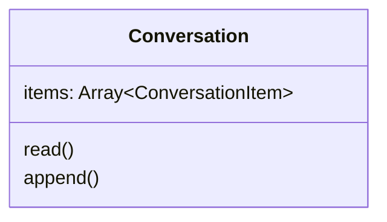
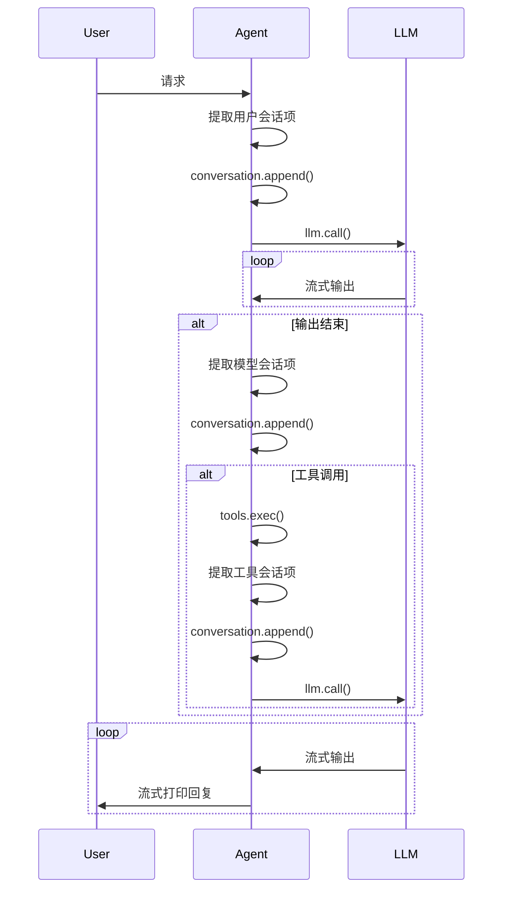

# 会话

会话（Conversation）是 Agent 保存多轮对话的容器。

**属性**

| 属性 | 类型 | 说明 |
| -- | -- | -- |
| items | Array<ConversationItem> | 会话项列表 |

**方法**

`read()`

读取会话列表并转换为适配 neurallink 的 `call()` 方法的入参结构。

`append(items: Array<ConversationItem>)`

向追加对应类型的 Conversation Item。返回追加后的完整 conversation。

## 流程

### 说明

- 在向模型发送请求前，总是遵循：“读取会话 -> 发送给模型“ 的流程。
    - 执行 `.append()` 方法会返回完整会话，效果同 `.read()` 一样。此时不需要显示调用 `.read()`。
- 模型可能一次返回多个输出项，需要遍历每个输出项然后将 item 按顺序插入到会话。
- 模型返回函数调用时，Agent 先将函数调用会话项插入会话，再执行函数调用并将结果追加到会话。

### 示例

以下为调用工具的流程示例：

## 会话项（ConversationItem）

会话项由用户、工具或模型生成。

### 提取用户会话项

当用户向 Agent 发送消息时，将用户消息进行归一化为对应会话类型，并插入到会话列表中。

用户会话项的 `role` 为 "user"。

### 提取模型会话项

当模型生成**完整**的响应对象后，从响应对象中提取并归一化对应会话类型，并插入到会话列表中。

模型会话项的 `role` 为 "assistant"。

### 提取工具会话项

当 Agent 从工具集中执行函数调用并获取到执行结果时，生成对应会话类型，并插入到会话列表中。注意：执行函数前从已有会话列表中提取前一轮模型生成的 `FunctionCall` 类型会话项的 `call_id` 属性。

模型会话项的 `role` 为 "tool"。

## 会话项类型

会话由一系列有序的会话项（Conversation Item）组成，会话项类型包括文本、图片、文件、推理、函数调用、函数输出等。

### Text

文本。

**属性**

| 属性 | 类型 | 说明 |
| -- | -- | -- |
| type | "text" | 会话项类型，固定为 "text" |
| role | oneOf("user", "assistant") | 会话项生成者 |
| text | string | 文本内容 |

### Image

图片。

**属性**

| 属性 | 类型 | 说明 |
| -- | -- | -- |
| type | "image" | 会话项类型，固定为 "image" |
| role | oneOf("user", "assistant") | 会话项生成者 |
| image | uri | 图片的 URI 地址 |

### File

文件。

**属性**

| 属性 | 类型 | 说明 |
| -- | -- | -- |
| type | "file" | 会话项类型，固定为 "file" |
| role | oneOf("user", "assistant") | 会话项生成者 |
| file | uri | 文件的 URI 地址 |

### Reasoning

推理。

**属性**

| 属性 | 类型 | 说明 |
| -- | -- | -- |
| type | "reasoning" | 会话项类型，固定为 "reasoning" |
| role | "assistant" | 会话项生成者，固定为 "assistant" |
| content | string | 推理正文 |
| summary | string | 推理摘要 |

### FunctionCall

函数调用。

**属性：**

| 属性 | 类型 | 说明 |
| -- | -- | -- |
| type | "function_call" | 会话项类型，固定为 "function_call" |
| role | "assistant" | 会话项生成者，固定为 "assistant" |
| call_id | string | 函数调用 ID |
| name | string | 函数名称 |
| arguments | string | 函数调用参数，JSON 字符串格式 |

### FunctionCallOutput

函数输出。

**属性：**

| 属性 | 类型 | 说明 |
| -- | -- | -- |
| type | "function_call_output" | 会话项类型，固定为 "function_call_output" |
| role | "tool" | 会话项生成者，固定为 "tool" |
| call_id | string | 关联的函数调用 ID |
| output | string | 函数执行的结果 |