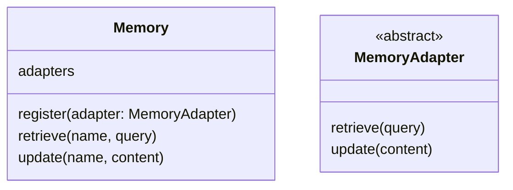
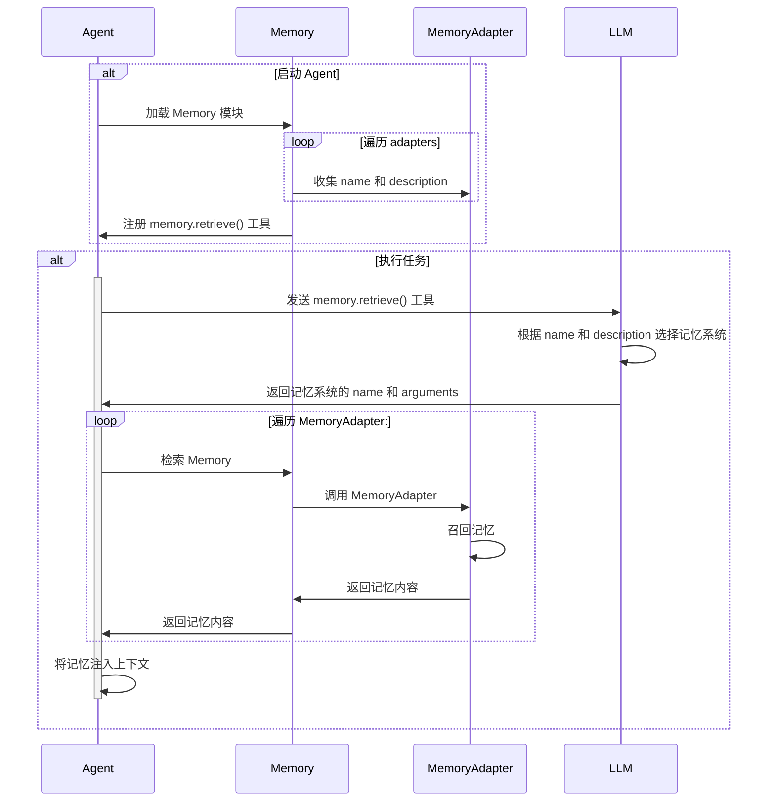

# 记忆

记忆是对 Agent 执行任务产生和所需的背景知识的管理模块。

## 记忆模块

记忆由负责主控的 Memory 模块和不同的记忆系统 MemoryAdapter 组成。 MemoryAdapter 需要实现一组抽象接口，并通过 Memory 模块提供的 `register()` 方法进行注册。



## 记忆召回

记忆的召回由以下过程构成：

1. LLM 选择记忆系统。
2. Memory 向 LLM 选择的记忆系统发起召回。
3. MemoryAdapter 调用各自的召回能力获取记忆内容，并返回给 Memory。
4. Agent 将召回内容注入上下文。

流程如下：



### 选择记忆系统

MemoryAdapter 需要按照 [tools](tools.md) `FuncTool` 的要求实现 `retrieve()` 方法，定义自身的 `name` 和 `description` 用于描述适用的召回场景。

Memory 模块在启动时先收集所有已注册的 `MemoryAdapter.retrieve()` 的自描述，将其注入到记忆召回工具的模板中。

记忆召回工具的模板如下：

```json
{
    "type": "function",
    "name": "memory.retrieve",
    "description": "召回记忆，可以从以下源选择合适的进行召回：\
                    % for adapter in adapters %
                        - name: ${adapter.name}
                          description: ${adapter.description}
                    % end %
                    ",
    "parameters": {
        "type": "object",
        "properties": {
            "name": {
                "enum": [% adapter.name for adapter in adapters %],
                "description": "记忆源的名称"
            },
            "query": {
                "type": "string",
                "description": "要召回的查询条件"
            }
        }
    }
}
```

### 发起召回

Agent 通过执行模型返回的 `memory.retrieve(name, query)`，以不同的 `name` 参数来路由到不同的记忆系统。记忆系统本身需要实现 `retrieve(query)` 方法以实现召回逻辑并返回召回结果，其中 `query` 参数为 Memory 主控传递过来的模型生成的调用参数。

### 注入上下文

Agent 以工具调用结果的方式将召回内容注入到上下文。

## 记忆更新

Agent 每次完成一轮任务时，会启动一个独立于主 Agent 进程的的子 Agent 用于评估是否需要更新记忆，该子 Agent 进程具备独立的生命周期。

MemoryAdapter 需要按照 [tools](tools.md) `FuncTool` 的要求实现 `update(content)` 方法，定义自身的 `name` 和 `description` 用于描述适用的更新场景。其中 `description` 需要清晰地描述 `content` 结构以便模型生成对应的参数。

启动子 Agent 时：

- 为子 Agent 配置该轮任务相关的 Conversation，该 Conversation 包含一轮任务相关的用户消息及模型的工具调用、工具结果、最终回复等一组消息项。子 Agent 可以向 LLM 发送 Conversation 以决定如何通过 memory.update 工具更新记忆。
- 为子 Agent 注入如下系统提示词：
    ```
    你的任务是更新记忆。

    你需要根据当前的会话上下文以及 `memory.update()` 工具的 `description` 决定调用哪些 MemoryAdapter 来更新记忆。

    你需要执行 memory.update 方法并生成 `name` 和 `content` 参数：

    - `name` 参数用于路由合适的 MemoryAdapter
    - `content` 参数用于透传给 MemoryAdapter.update(content) 方法，因此 `content` 的参数结构必须按照工具描述中定义的结构生成。

    你可以从以下记忆系统中进行选择：

    % for adapter in adapters %
        - name: ${adapter.name}
          description: ${adapter.description}
    % end %

    一旦完成任务立即退出。
    ```

## MemoryAdapter

具体的 MemoryAdapter 列表如下：

- 术语表记忆 [TermsMemoryAdapter](terms-memory-adapter.md)