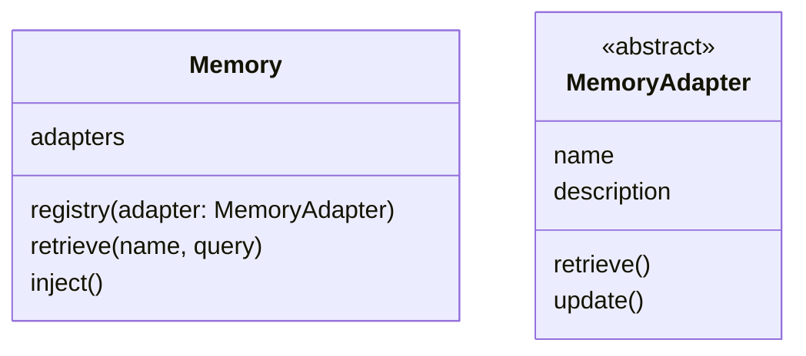
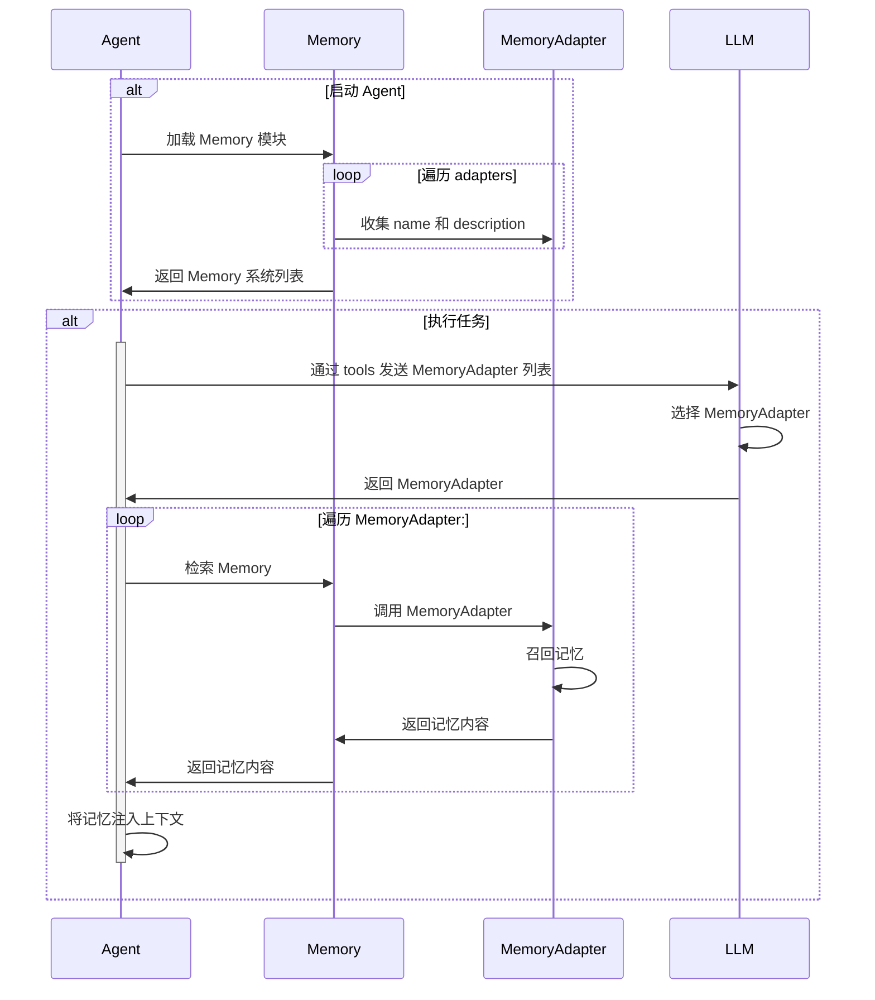

# 记忆

记忆是对 Agent 执行任务产生和所需的背景知识的管理模块。

## 记忆模块

记忆由负责主控的 Memory 模块和不同的记忆系统 MemoryAdapter 组成。 MemoryAdapter 需要实现一组抽象接口，并通过 Memory 模块提供的 `registry()` 方法进行注册。



## 记忆召回

记忆的召回由以下过程构成：

1. LLM 选择记忆系统。
2. Memory 向 LLM 选择的记忆系统发起召回。
3. MemoryAdapter 调用各自的召回能力获取记忆内容，并返回给 Memory。
4. Memory 模块将召回内容注入上下文。

流程如下：



### 选择记忆系统

MemoryAdapter 需要定义自身的 `name` 和 `description`，用于描述自身的适用场景。Memory 模块在启动时先收集所有已注册的 MemoryAdapter 的自描述，组成发送给 LLM 的 tools 参数，由 LLM 决定是否在当前任务阶段需要召回记忆。

Agent 通过在 tools 中填充 Memroy.retrieve(name, query) 工具的 Schema 模板向 LLM 发送 MemoryAdapter 的列表。Memroy.retrieve(name, query) 模板定义如下：

```json
{
    "type": "function",
    "name": "memory.retrieve",
    "description": "从不同的源进行记忆的召回，以下是可选的源的名称和描述：\
                    % for name, description in MemoryAdapter %
                        - name: ${name}
                          description: ${description}
                    % end %
                    ",
    "parameters": {
        "type": "object",
        "properties": {
            "name": {
                "enum": [% name for name in MemoryAdapter %],
                "name": "MemoryAdapter 的名称"
            },
            "query": {
                "type": "string",
                "name": "要召回的查询条件"
            }
        }
    }
}
```

### 发起召回

Agent 通过多次执行 LLM 返回的 `Memroy.retrieve(name, query)`，并以不同的 `name` 参数来区分不同的 MemroyAdapter。Agent 可能以不同的 `name` 参数一次调用多个 `MemroyAdapter.retrieve()` 来从不同的源获取记忆。

### 注入上下文

Agent 以工具调用结果的方式将召回内容注入到上下文。

## 记忆更新

Agent 在每次完成一轮任务时，无论任务结果成功还是失败，都需要向 Memory 模块推送这一轮任务的完整上下文并附带元数据信息。

任务上下文的范围不需要包含历史上下文，而是从用户请求开始到 Agent 任务结束过程中的所有 Conversaion Items。其结构如下：

```
{}
└─ conversation
    └─ id
    └─ items[]
```

Memory 模块收到 Conversation Context 之后会转发给所有已注册的 MemoryAdapters。MemoryAdapter 按照各自的逻辑处理并存储收到的 Conversation Context。以最简单的 ConversationMemoryAdapter 为例：

## MemoryAdapter

具体的 MemoryAdapter 列表如下：

- 术语表记忆 [TermsMemoryAdapter](terms-memory-adapter.md)