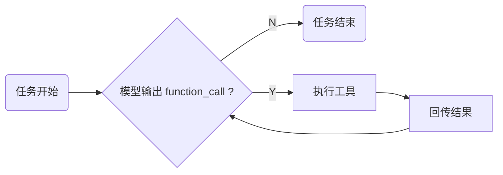

# ReAct

Agent 在执行任务过程中可能会需要尝试多个工具，或使用不同参数多次尝试工具。Agent 需要按照以下流程实现 ReAct：

```mermaid
flowchart LR

Start(任务开始) --> HasFunctionCall{模型输出 function_call ?}
HasFunctionCall --N--> End(任务结束)
HasFunctionCall --Y--> CallFunction[执行工具] --> SummaryResult[回传结果] --> HasFunctionCall
```
