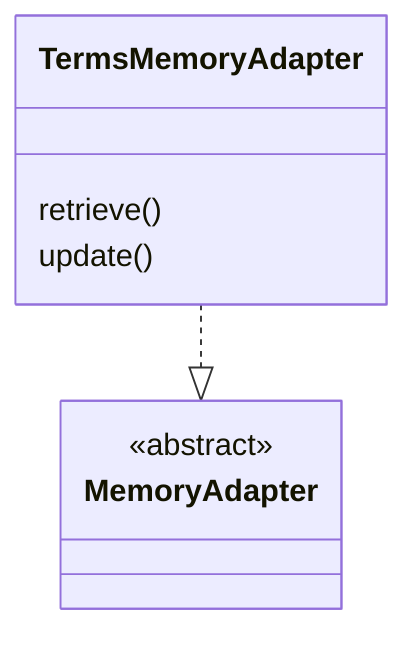

# TermsMemoryAdapter

TermsMemoryAdapter 用于将 Agent 执行任务过程中需要理解的术语表保存到当前工作目录的 `memories/TERMS.md`。

## 实现

TermsMemoryAdapter 实现 [记忆](memory.md) 模块中的 MemoryAdapter 接口。



### 方法

#### `retrieve(query)`

| 方法属性 | 类型 | 说明 |
| -- | -- | -- |
| name | string | "terms_memory" |
| description | string | "术语记忆。当用户输入的任务中存在尚未明确的缩写或专有名词术语时进行召回。" |

使用大小写不敏感的关键词完整匹配来召回相应的定义，支持一次传入多个术语，返回 `{term: definition}` 的 JSON 数据结构，例如：`{"WallE": "WallE 是一个自研的 Agent 系统。", "DIP": "DIP 是智能决策平台（Decision Intelligence Platform）的缩写。"}`

#### `update(content)`

| 方法属性 | 类型 | 说明 |
| -- | -- | -- |
| name | string | "terms_memory" |
| description | string | "术语记忆。更新记忆任务上下文中存在用户解释过的术语或用户做出选择的多义词时更新记忆，参数 JSON Schema 为 `{term, definition}`" |

`content` 为 JSON 字符串，Schema 如下：

```json
{
    "term": {
        "type" "string",
        "description": "术语名词"
    },
    "definition": {
        "type": "string",
        "description": "术语定义"
    }
}
```

更新时，先检查 `term` 在现有术语表中是否存在，如果存在则覆盖定义；如果不存在则在尾部追加。

## 数据结构

TermsMemoryAdapter 使用简单的 Markdown 保存术语定义，术语之间使用分隔符 `---` 进行隔离。

每一条术语包含以下元素：

- 术语名词
- 术语定义
- 术语元数据，JSON 字符串形式

示例如下：

```markdown
WallE 
WallE 是一个自研的 Agent 系统。
{"created_at": 1787891414440}
---
DIP
DIP 是智能决策平台（Decision Intelligence Platform）的缩写。
{"created_at": 1787891418887}
```
