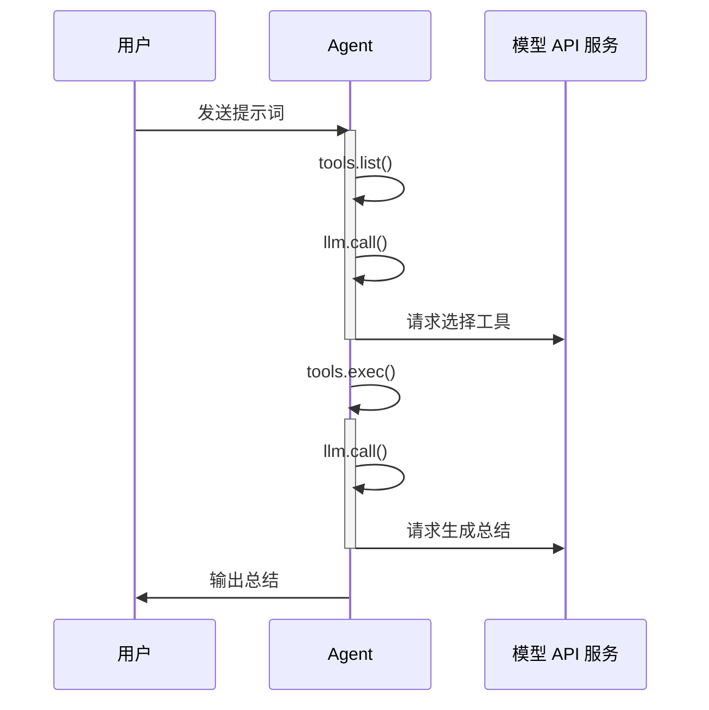
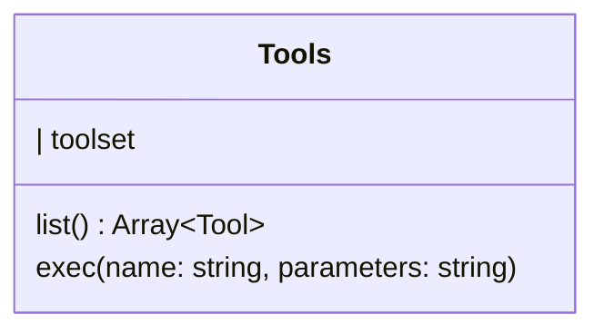

# 工具

工具（Tools）是 WallE 内部的工具管理模块，提供列举工具集及注册工具的接口。

## 使用工具

Agent 使用按照以下流程使用工具：



### 示例

```typescript
import { Agent, Connector as LLM, ResponsesAPIConverter } from "walle";

const agent = new Agent({
    llm: new LLM({
        baseUrl: 'https://example.com/v1/responses',
        apiKey: process.env.LLM_API_KEY!,
        converter: new ResponsesAPIConverter(),
    })
})

for await event of agent.query('deepseek-v4-flash', '明天上海的天气怎么样？') {
    console.log(event.delta)
}

```

## 工具集

工具集有两个作用：

1. 用于构建 LLM 所需的 `tools` 参数。
2. 用于保存实际的工具函数。




**属性**

| 属性 | 类型 | 说明 |
| -- | -- | -- |
| toolset | Map<string, ToolDef> | 工具集合。以工具名称为 key，工具定义 + 工具本体为值。 |

**方法**

`.list(): Array<Tool>`

列举工具集，返回需要传入给 Connector 的规范化 tools 参数。Tool 为 neuralink 定义的类型。

`.exec(name, parameters): any`

执行指定工具。传入工具名称和 JSON 字符串类型的调用参数，返回执行结果。

**类型**

`ToolDef`

**属性**

| 属性 | 类型 | 说明 |
| -- | -- | -- |
| schema | Tool | 工具定义 |
| fc | function | 工具函数本体 |

## 内置工具

WallE 内置以下工具：

### **bash**<a id="bash"></a>
 
 WallE 内置 `bash` 工具，用于执行 Bash 命令。`bash` 工具接收 `command` 作为参数，返回 stdout 和 stderr。 Schema 定义如下：

 ```yaml
 name: bash
 description: |
    在当前工作目录执行一条 bash 命令，返回 stdout 和 stderr。
    出于安全考虑，只支持：ls、find、grep 等文件 read-only 命令，但禁止使用 edit、delete 类参数
    严禁执行任何权限命令：su、sudo、chmod、chown 等
    严禁执行任何删除命令：rm、rmdir 等
    严禁执行任何磁盘操作命令：mount、unmount、fdisk 等，但可以执行 du、df 等查看操作。
 parameters:
    - type: object
    - properties:
        - command:
            - type: string
            - description: 一条 bash 命令
 ```